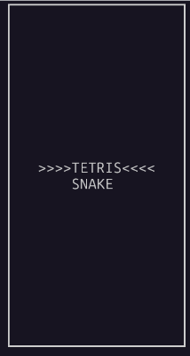
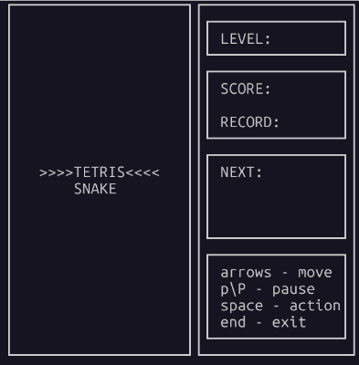
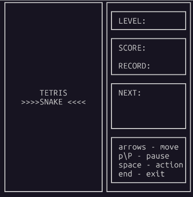

# 🕹️ Brick Game Console Collection

Консольная реализация классических игр "Тетрис" и "Змейка" с архитектурой MVC. 
Проект демонстрирует навыки работы с C++17, C, ООП, паттернами проектирования 
и низкоуровневым вводом/выводом.

## 🎮 Скриншоты

| Меню выбора игры | Геймплей 🧱 Тетриса | Геймплей 🐍 Змейки |
|:----------------:|:-----------------:|:----------------:|
|  |  |  |

## ✨ Особенности

- **Две игры в одной**: Переключение между Тетрисом и Змейкой без перезапуска
- **MVC архитектура**: Чистое разделение логики, контроллеров и отрисовки
- **Полиморфизм**: Абстрактный контроллер для единообразного управления играми
- **Работа с математикой**: Координаты, преобразования в пространстве (змейка)
- **Сохранение рекордов**: Хранение лучших результатов в файлах

## 🛠 Технологии

- **Языки**: C++17 (Змейка), C99 (Тетрис)
- **Сборка**: Make
- **Библиотеки**: ncurses (терминальный интерфейс)
- **Стиль кода**: Google C++ Style, Doxygen комментарии

## 🏗 Архитектура

```
┌─────────────────────────────────────────────────────────────────────────────┐
│                             BRICK GAME ARCHITECTURE                         │
├───────────┬─────────────────────────────────────────────────────────────────┤
│   Layer   │                         Components                              │
├───────────┼─────────────────────────────────────────────────────────────────┤
│           │  ┌─────────────────────────────────────────────────────────┐    │
│   VIEW    │  │                    CliView (ncurses)                    │    │
│           │  │  - print_menu()    - print_game()    - get_signal()     │    │
│           │  └─────────────────────────────────────────────────────────┘    │
├───────────┼─────────────────────────────────────────────────────────────────┤
│           │  ┌─────────────────────────────────────────────────────────┐    │
│ CONTROLLER│  │                 GameController (Стратегия)              │    │
│           │  │  - setGame() - выбирает стратегию                       │    │
│           │  │  - play() - делегирует текущей стратегии                │    │
│           │  └─────────────────────────────────────────────────────────┘    │
│           │                           │                                     │
│           │           ┌───────────────┴───────────────┐                     │
│           │           ▼                               ▼                     │
│           │  ┌─────────────────────┐     ┌─────────────────────┐            │
│           │  │   SnakeController   │     │  TetrisController   │            │
│           │  └─────────────────────┘     └─────────────────────┘            │
├───────────┼─────────────────────────────────────────────────────────────────┤
│           │  ┌─────────────────────┐     ┌─────────────────────┐            │
│   MODEL   │  │     Snake Model     │     │    Tetris FSM       │            │
│           │  └─────────────────────┘     └─────────────────────┘            │
├───────────┼─────────────────────────────────────────────────────────────────┤
│   DATA    │  ┌─────────────────────────────────────────────────────────┐    │
│           │  │              high_score.txt                             │    │
│           │  └─────────────────────────────────────────────────────────┘    │
└───────────┴─────────────────────────────────────────────────────────────────┘

                              ПАТТЕРНЫ ПРОЕКТИРОВАНИЯ
┌─────────────────────────────────────────────────────────────────────────────┐
│  Стратегия │ GameController выбирает стратегию через setGame()              │
├─────────────────────────────────────────────────────────────────────────────┤
│  Адаптер   │ SnakeController/TetrisController адаптируют модели под         │
│            │ единый интерфейс VirtualController                             │
└─────────────────────────────────────────────────────────────────────────────┘
```

### Ключевые компоненты:

- **VirtualController**: Абстрактный класс с методом `play(UserAction_t)`
- **GameController**: Реализует паттерн "Стратегия" для выбора игры
- **Snake**: Полноценная ООП-модель на C++ (конечный автомат реализован через switch case)
- **Tetris FSM**: Конечный автомат на C (реализован через таблицу переходов 8x9)

## 🚀 Установка и запуск

### Требования
- Linux
- ncurses
- g++ с поддержкой C++17


### Сборка

```bash
# Клонирование
git clone https://github.com/urbanvyacheslav/brickgame.git
cd brickgame/src

# Сборка через Makefile
make

# Запуск
./cli_brick_game
```

### Управление

| Клавиши | Действие |
|---------|----------|
| ↑/W, ↓/S, ←/A, →/D | Движение |
| Пробел | Поворот (Тетрис) / Действие (Змейка) |
| P | Пауза |
| ESC | Выход в меню |
| End | Выход |
| Enter | Выбор / Старт |
